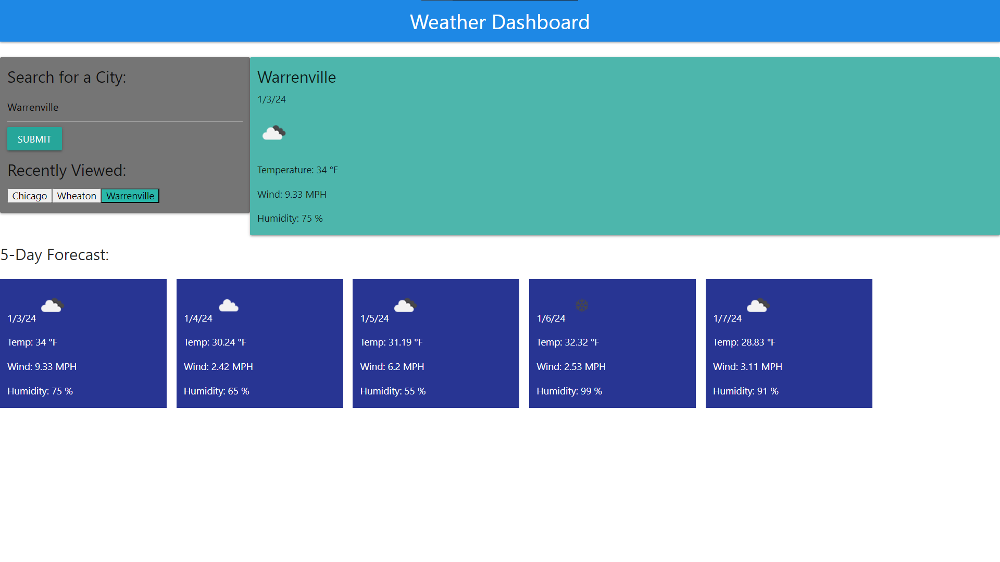

# <Creating Weather Dashboard: Week-6-Challenge (Server-side APIs)>

## Description

The motivation behind this project was to create a weather dashboard application where users can search for current and future weather conditions of cities around the world. I utilized my knowledge of calling to server-side APIs in order to extract data in real time and provide current and future weather conditions for any city the user would like to search. The site provides the user with the current day forecast as well as a 5 day forecast. Each day is given an icon unique representative of the current weather. Each day also provides the user with information about temperature (in degrees fahrenheit), wind (MPH), and humidity (%). Note that on page load, the default city preloaded to the page is Austin, TX. Through building this application I learned how to properly retrieve data from a server side API, the importance of query-parameters used when calling the API, how reformat that data so it could then be appended to my page, all with the use of JavaScript. I also learned how to properly utilize the materialize CDN framework here within this application as well, utilizing their grid layout and button functionality to give my page the desired look. This application helped me see how intricate function re-useability can become as well as its significance.

## Live URL
https://ihateudvrk.github.io/weather-dashboard/

## Screenshot

## Technologies Used

This project utilizes HTML, CSS, JavaScript, Materialize, and OpenWeather API (server-side API).

## Features

Features of this page include the users ability to load weather data from any city of their choosing and see real time data displayed to their page of the current conditions along with a 5 day forecast. Once a city has been searched for, the data attributed with that city will be stored in local storage and can then be re-appended to the page using the recent search buttons, which will allow data to be pulled from local storage rather than fetching from the API again (this will limit the amount of times the user will hit the API).
